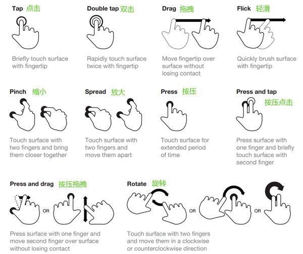
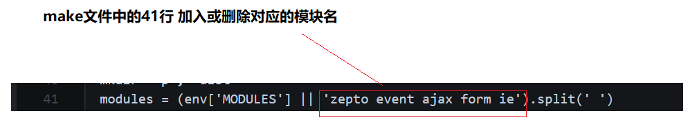

# 1. 移动web第1天

## 1.1. 学习目标

- 理解
  - 知道屏幕常见参数 
  - 了解失真的原因以及解决
  - 了解视口、布局视口、理想视口的概念
- 应用
  - 手机京东-静态页面制作

## 1.2. 介绍

### 1.2.1. 概念

专门为移动设备制作的web

### 1.2.2. 误区

不是在移动设备上运行的网站就叫做移动web!

### 1.2.3. 相对于pc网站,手机app的优势

#### 1.2.3.1. 相比pc网站

- 用户量大
- 随时随地使用
- 浏览器版本高-可以体验更好的技术

#### 1.2.3.2. 相比移动app

- 学习成本低- html+css+js
- 一次编码,多个平台通用 只需要一个浏览器即可运行。
- 可通过工具 将网站打包成不同平台的app  如**andriod app** **ios app**
- 发布简单-不用经过审核-如苹果app的审核机制繁琐

### 1.2.4. 了解移动端发展

[友盟数据报告](http://mobile.umeng.com/reports)


## 1.3. 屏幕知识


| 设备           | 解释                         | 描述                                              |
| -------------- | ---------------------------- | ------------------------------------------------- |
| 宽             | 屏幕的宽度 - 英寸            |                                                   |
| 高             | 屏幕的高度 - 英寸            |                                                   |
| 对角线         | 屏幕的对角线的长度 英寸      | 一般说手机尺寸 是指以屏幕对角线为衡量 单位是 英寸 |
| **逻辑分辨率** | 屏幕的宽度 * 屏幕的高度   px | 描述屏幕的宽度和高度                              |
| scale Factor   | 放大比例                     | 手机屏幕的清晰倍数                                |
| **设备分辨率** | 物理像素点                   | 屏幕里面一共拥有的物理像素点的个数                |
| PPI            | 像素密度                     | 每英寸所拥有的物理像素点                          |

**Retina**- 苹果从iphone4 搭载更加清晰的屏幕-叫做 **retina **，为这个名字申请了专利 ,视网膜屏,高清屏,二倍屏,三倍屏都是指更加清晰的屏幕。

下面重点关注 逻辑分辨率 和 设备分辨率 

**iphone 3 逻辑分辨率 和 设备分辨率 的关系**


**iphone 4  逻辑分辨率 和 设备分辨率 的关系**


## 1.4. 失真

把一张普通的图片放在iphone3上显示正常，但是放在iphone4上就变得模糊了。

### 1.4.1. **前置知识**:

- 屏幕宽度一样的情况下，谁的设备分辨率越高，谁的屏幕就越清晰。

- iphone3 和 iphone4的屏幕大小一样，iphone4设备分辨率比iphone3 要高。

  

### 1.4.2. 原因：


使用css设置了一个区域以后，高清屏含有的像素点数是普通屏的4倍 相当于说 

有一张图片 大小是1px * 1px  物理像素点也是1 

- 在iphone3显示正常，因为 iphone3 的 1px*1px 里 放了只放了一个物理像素点 刚好和图片相对应
- 在iphone4下变得模糊，因为 iphone4 下 1px *1px 大小的格子里放了4个物理像素点，屏幕变得更加细腻，但是图片还是普通的图片，所以看起来变得模糊。


### 1.4.3. 失真解决

根据不同清晰度的屏幕 加载不同清晰度的图片即可。

#### 1.4.3.1. 解决方案 1 ：

通过js的手段解决，在js的全局对象 window中有一个属性叫做 **设备像素比** **window.devicePiexlRatio**,它可以检测当前屏幕的清晰度的倍数。

- 获取屏幕的清晰度的倍数

- 根据不同的倍数加载不同倍数的图片

  ```javascript
    // 判断屏幕的类型
    if(devicePixelRatio==2){
      // 2 倍屏幕
      img.src="../images/赵丽颖.png";
    }
    if(devicePixelRatio==3){
      // 3 倍屏幕
      img.src="../images/高圆圆.png";
    }
  ```

#### 1.4.3.2. 解决方案 2：

因为图片的显示仅仅是标签的工作，而通过js的方法解决太繁琐了。 所以，可以使用 一个图片标签的属性 `srcset` 它可以方便的实现功能。

1. 新建一个图片标签 img
2. 在标签内加入 `srcset` 属性
3. 属性值为 **图片路径 屏幕倍数,图片路径 屏幕倍数 ** 如 下面的代码

```html
  
```

#### 1.4.3.3. 解决方案 3 ：

​	其实现在工作里面主流的方法，统一都是使用高清图。也就是说 让美工妹子准备一张更加清晰的图片即可，我们在使用的时候 按照以前的方式直接使用就好了。

那么前两种解决方案什么时候使用呢？

> 项目经理或者组长明确要求说根据不同清晰度的设备加载不同的图片时 

## 1.5. 视口

视口就是指我们在浏览器中看到的网页内容的区域


### 1.5.1. 布局视口和理想视口

在移动端中，视口有两个 ，一个是 **布局视口** 另外一个是 **理想视口**

- 布局视口 只需了解  **写代码的时候不会使用**

- 理想视口 需要学习了解，只要写移动web 一定要使用 **理想视口**

- 两者的区别 只看有没有这一行代码 

  ```html
    <meta name="viewport" content="width=device-width, initial-scale=1.0">
  ```

  - 没有 那就是 布局视口 
  - 有    是理想视口

### 1.5.2. 布局视口 了解

代码： 没有添加 `  <meta name="viewport" content="width=device-width, initial-scale=1.0">`

```html
<!DOCTYPE html>
<html lang="en">
<head>
  <meta charset="UTF-8">
  <title>布局视口</title>
</head>
<body>
  
</body>
</html>
```

在谷歌浏览器中使用 移动端模拟 模式打开


#### 1.5.2.1. 结论

可以看到，在布局视口下，html标签的宽度变成了 **980px** 而不是 和 **屏幕等宽**

- 980px 是手机厂商为了做兼容而设置的，因为以前的网站的**版心宽度**一般都是小于等于980px

- 把一个980px宽的页面放入到375px的小屏幕上， 后果就是页面元素 被缩小了

  

- 以上结果，不是我们移动端希望看到的，所以我们 使用 **理想视口** 而 不是 **布局视口**。


### 1.5.3. 理想视口

只要在代码里面加入了 以下代码，就可以把布局视口变成了**理想视口** 

```html
  <meta name="viewport" content="width=device-width, initial-scale=1.0">
```

完整代码

```html
<!DOCTYPE html>
<html lang="en">
<head>
  <meta charset="UTF-8">
  <title>理想视口</title>
  <meta name="viewport" content="width=device-width, initial-scale=1.0">
  <style>
    div{
      width: 100px;
      height: 100px;
      background-color: aqua;
    }
  </style>
</head>
<body>
  <div></div>
</body>
</html>
```


### 1.5.4. 理想视口详细解释

**标准**的理想视口的代码的写法如下：

```html
<meta name="viewport" content="width=device-width, initial-scale=1.0,maximum-scale=1,minimum-scale=1,user-scalable=no">
```

在html页面中 按入  `meta:vp` **+ tab**  即可快速敲入理想视口的代码   此为普通的理想视口的写法

```html
 <meta name="viewport" content="width=device-width, initial-scale=1.0">
```

标准的写法比普通的写法 多了一些设置。 

- 使用**标准**的写法可以一些莫名其妙的问题 **后期会演示**（触屏事件中的clientX/Y和pageX/Y的演示）
- 使用**普通**的写法可能会出现一些莫名其妙的问题

**在写项目中建议使用标准的写法**

**参数的描述  了解即可**

- meta标签用来描述或设置一个HTML网页文档的属性
- content 要设置或者描述的内容
- width 设置视口的宽度 **device-width**等于屏幕的宽度
- initial-scale 页面打开的时候视口放大的倍数  **值:1**
- user-scalable 是否允许用户缩放页面 **值：no**
- maximum-scale 如果允许放大的话 最大放大多少倍 **值 ：1**
- minimum-scale  如果允许放大的话 最小放大多少倍 **值 ：1**


## 1.6. css预处理器

一套可以提高编写css代码的技术

[中文官网](http://lesscss.cn/)

### 1.6.1. 有哪些css预处理器

- less
- sass
- stylues

### 1.6.2. less的执行过程

1. 编写符合less语法的less文件
2. 使用工具将less文件编译成css文件
3. 页面中引用编译好的css文件

### 1.6.3. less语法

#### 1.6.3.1. 变量

```less
// 声明变量
@color:red;
// 使用变量
body{
    background:@color;
}
```

### 1.6.4. 混合-函数

```less
// 声明函数 .函数名(@参数名)
.changeColor(@c){
  background-color: @c;
}

// 使用函数
body{
  .changeColor(red);
}
```

#### 1.6.4.1. 嵌套

```less
#id{
  .c1{
    // 后代
    a{}
    // 子代
    >p{}
    // 伪元素
    &:before{}
  }
}
```

#### 1.6.4.2. 导入

a.less

```less
body{
  background-color: red;
}

```

b.less

```less
@import "a.less";

```

生成b.css

```css
body {
  background-color: red;
}

```

#### 1.6.4.3. 注释

```less
// 不会被编译
/* 会被编译 */


```

### 1.6.5. less工具

- vs code 插件 **easy less**在插件搜索列表中安装即可,插件安装后,重启 vs code,然后编辑less文件,保存less文件时 自动编译 
- 考拉编译工具 考拉官方网站](http://koala-app.com/index-zh.html)


## 1.7. 手机京东案例-静态页面

主要使用百分比布局（流式布局完成）


# 2. 移动web第2天

## 2.1. 学习目标

- 理解
  - 手机京东头部透明效果
  - 手机京东倒计时效果
  - 真机调试的过程
  - 3个触屏事件
  - 3个触摸点数组
  - 3对坐标信息
- 应用
  - 封装移动端点击tap
  - 封装移动端滑动swipe

## 2.2. 真机调试

在写移动端页面时，可以在谷歌浏览器里面很方便的进行调试。可是这种方式 只是模拟调试，项目上线之前，肯定是需要通过 在真正的手机上调试，然后再发布上线的。

### 2.2.1. 模拟调试

在电脑上通过模拟工具（谷歌手机调试等）调试页面的过程 - 模拟调试

### 2.2.2. 真机调试

在电脑上通过**工具** 去调试 手机里面的页面的过程 - 真机调试 

### 2.2.3. 真机调试步骤：

- 为了上课显示需要，把手机屏幕投影到电脑上
- - iphone手机可以使用**itools录屏大师**
  - 安卓手机可以使用谷歌浏览器插件 **vysor** 或者 **airdroid** 软件
- 手机 和 电脑处在同一个局域网内（电脑上开启无线wifi即可）
- 把需要调试的页面放在电脑特定的服务器软件（**ghostlab**-联网使用）内，开启服务器软件 
- 在手机的浏览器中 输入 电脑服务器的 局域网 IP地址（在电脑的cmd 上输入 **ipconfig**）
- 使用调试工具 **ghostlab** 进行调试


**1 电脑开启wifi，手机连接上**


**2 电脑开启服务器软件 ghostlab**


3 选择要调试的页面


**4  开启服务器**


**5 在手机中打开 网站地址**


**6 开启代码调试工具**


**完整步骤**


### 2.2.4. 总结

- 公司中有专门的测试人员
- 大型公司,将项目外包出去交由第三方公司做测试
- 自己完成测试任务- 再花时间去 学习真机调试的步骤（晚自习不用花时间去学习）


## 2.3. 触屏事件

### 2.3.1. 需求

1. 鼠标事件不能满足多指触控的需求
2. click点击事件在移动端存在延迟

### 2.3.2. click延迟解释

演示代码

```html
<!DOCTYPE html>
<html lang="en">
<head>
  <meta charset="UTF-8">
  <title>延迟.html</title>
  <style>
    div:nth-child(1) {
      width: 200px;
      height: 200px;
      background-color: aqua;
      margin: 100px auto;
    }
  </style>
</head>
<body>
  <div></div>
  <script>
    var div = document.querySelector("div");
    div.addEventListener("click", function () {
      alert("点我点我");
    })
  </script>
</body>
</html>
```


在pc端下 **双击**  和 在移动端 下 **双击**   div 观察现象：


**解释**：

在移动端上 执行双击时

- 在第一次单击过后，浏览器等待了一小段时间
- 如果在短时间内
  - 有第二次的点击发生 触发 双击放大
  - 没有第二次点击  触发的 click 点击事件

也就是说 在第一次点击过后，不管有没有第二次的点击产生，都会先等待一小段时间。


**谁做的处理？**

这个机制 也是手机厂商为了方便 用户放大页面 做的处理。所带来的后果就是 click有延迟，降低了用户体验。


**学习触屏事件的目的：**

因此，我们学习触屏事件就是为了解决click延迟，封装常见的手势事件。

### 2.3.3. 概念

手指触摸到移动设备的时候所发生的一些事件 


### 2.3.4. 触屏事件类型

- **touchstart** 手指触摸到屏幕的时候触发 对比 mousedown
- **touchmove** 手指在屏幕上滑动的时候触发 对比mousemove
- **touchend** 手指离开屏幕的时候触发 对比mouseup

**注意：**

- 建议 **dom.addEventListener**的方式绑定，不建议使用 **dom.ontouchstart** 的方式绑定 （低版本不识别）

  ```javascript
     div.addEventListener("touchstart", function () {
       
      })
  ```

- 触屏事件只能用在移动端上，在pc端上无法触发

### 2.3.5. 3个触摸点对象数组

当多个手指触摸到屏幕上时，这些手指的坐标等相关信息，存放在了 3个不同的触摸点数组当中。

- **touches** 屏幕上所有的触摸点的集合
- **targetTouches** 目标元素上触摸点的集合
- **changedTouches** 在目标元素上发生了进入,离开和移动的触摸点的集合


#### 2.3.5.1. 学习touches 和 targeTouches

给一个div绑定 touchstart事件，事件中打印出 这两个数组的长度

```html
  <style>
    div:nth-child(1) {
      width: 200px;
      height: 200px;
      background-color: aqua;
      margin: 100px auto;
    }
  </style>
</head>

<body>
  <div></div>
  <script>
    var div = document.querySelector("div");
    div.addEventListener("touchstart",function (e) {
      console.log("屏幕上:"+e.touches.length);
      console.log("目标元素上:"+e.targetTouches.length);
    })
  </script>
</body>
```


#### 2.3.5.2. 学习targetTouches和changedTouches

给div绑定 **touhchend**事件 事件中分别打印 targetTouches 长度

```javascript
  <style>
    div:nth-child(1) {
      width: 200px;
      height: 200px;
      background-color: aqua;
      margin: 100px auto;
    }
  </style>
</head>

<body>
  <div></div>
  <script>
    var div = document.querySelector("div");
    div.addEventListener("touchend",function (e) {
      console.log("目标元素上:"+e.targetTouches.length);
      console.log("屏幕上状态改变:"+e.changedTouches.length);
    })
  </script>
</body>
```


#### 2.3.5.3. 小结

- 如果要获取离开屏幕的手指的信息 ，只能通过 **touchend** 事件中的 **changedTouches** 数组
- 由于**changedTouches** 数组功能还不够完善，同时离开2个、3个手指时，它的长度都 是 1 
- 当需要获取多个同时离开屏幕的手指信息时，可以结合同时结合3个触摸点数组来做处理（了解即可-具体情况具体分析）

### 2.3.6. 触摸点对象的3对位置属性

- clientX/clientY 相对于浏览器视口的坐标
- pageX/pageY 相对于页面的坐标
- screenX/screenY 相对于屏幕的坐标


### 2.3.7. 手势封装

使用三个触屏事件**touchstart**,**touchmove**,**touchend**封装自己的手势事件 

 

#### 2.3.7.1. 封装移动端点击事件tap

- 判断按下的手指个数不能超过1
- 判断手指按下的时间不能太长 100ms
- 判断手指按下的时候滑动的距离不能太长 15px

#### 2.3.7.2. 封装移动端滑动事件swipe

- 判断按下的手指个数不能超过1
- 判断手指按下的时间不能太长 300ms
- 判断手指按下的距离不能太短-同时需要判断手指的方向


# 3. 移动web第3天

## 3.1. 学习目标

- 理解
  - 手机京东-轮播图原生js实现
  - zepto使用
  - zepto定制
  - 手机京东-zepto改造
  - swiper.js插件使用
  - 手机京东-swiper.js轮播图使用
- 应用
  - 京东分类页面-静态页面


## 3.2. zepto.js

被称为移动端的 **jquery**

### 3.2.1. 在线地址

- [下载地址](https://github.com/madrobby/zepto)
- [中文API](http://www.css88.com/doc/zeptojs_api/)

### 3.2.2. 体验

1. 引入js文件
2. 像jquery一样进行使用

```html
<!DOCTYPE html> <html lang="en"> <head> <meta charset="UTF-8"> <meta name="viewport" content="width=device-width, initial-scale=1.0,maximum-scale=1,minimum-scale=1,user-scalable=no"> <title>03-zepto.html</title> <style> div{ width: 200px; height: 200px; background-color: aqua; margin: 100px auto; } </style> </head>
<body>
  <div></div>
  <!-- 引入zepto.js -->
  <script src="./zepto.js"></script>
  <script>
    // 绑定点击事件
    $("div").click(function () {
      // 链式编程 显示又隐藏
      $("div").hide().show();
    });
  </script>
</body>

</html>
```

### 3.2.3. 模块化

不同于jquery将所有的代码都放入一个js文件中，zepto按照不同的模块拆分成了不同的js文件。


当你在使用zepto的时候，出现了如下报错的代码，那是提示你记得要引入对应的模块

**xxx Is not a function**


### 3.2.4. 定制zepto 了解

如果我们需要引入 **zepto**的很多个模块的话，都单独引入反而变得更麻烦


所以，最好是把一些常用模块直接打包到一个单独的 **zepto.js** 文件中

其实 github也有 [定制](https://github.com/madrobby/zepto#building) 的介绍 

定制zepot的步骤：

1. 下载nodejs  [下载地址](http://nodejs.cn/download/)

2. 安装nodejs  [安装说明](https://www.runoob.com/nodejs/nodejs-install-setup.html)

3. github下载zepto项目

4. 在zepto文件中，打开命令行工具 （shift+鼠标右键）

5. 在命令行工具中输入  `npm install`  等待安装完成  

   

6. 打开目录下的 `make` 文件  ，找到第41行 

   

7. 在命令中 输入  `npm run-script dist`   开始定制

   

8. 找到根目录下的 `dist`文件夹  所生成的zepto.js 就是 我们自己定制的zepto

   


## 3.3. swiper.js

**Swiper**常用于移动端网站的内容触摸滑动

### 3.3.1. 在线地址

[swiper.js官方网站](http://www.swiper.com.cn/)

[swiper.js下载地址](http://www.swiper.com.cn/download/index.html)

[在线API](http://www.swiper.com.cn/api/index.html)

### 3.3.2. 入门教程

1.首先加载插件，需要用到的文件有[swiper.min.js](http://www.swiper.com.cn/download/index.html#file7)和[swiper.min.css](http://www.swiper.com.cn/download/index.html#file5)文件。

```html
<!DOCTYPE html>
<html>
<head>
    ...
    <link rel="stylesheet" href="path/to/swiper.min.css">
</head>
<body>
    ...
    <script src="path/to/swiper.min.js"></script>
</body>
</html>
```

2.需要设置的HTML内容。

```html
  <!-- Swiper容器 -->
  <div class="swiper-container">
    <div class="swiper-wrapper">
          <!-- slide 轮播项 -->
      <div class="swiper-slide">Slide 1</div>
      <div class="swiper-slide">Slide 2</div>
      <div class="swiper-slide">Slide 3</div>
      <div class="swiper-slide">Slide 4</div>
      <div class="swiper-slide">Slide 5</div>
      <div class="swiper-slide">Slide 6</div>
      <div class="swiper-slide">Slide 7</div>
      <div class="swiper-slide">Slide 8</div>
      <div class="swiper-slide">Slide 9</div>
      <div class="swiper-slide">Slide 10</div>
    </div>
    <!-- 分页器 -->
    <div class="swiper-pagination"></div>
    <!-- 导航器 -->
    <div class="swiper-button-next"></div>
    <div class="swiper-button-prev"></div>
  </div>
```

3.初始化Swiper：最好是挨着</body>标签

```javascript
  var swiper = new Swiper('.swiper-container', {
      spaceBetween: 30,
      centeredSlides: true,
      autoplay: {
        /* 多少时间轮播一次 毫秒 */
        delay: 1000,
        /* 用户滑动轮播图之后，是否禁止自动轮播图 默认是 true 禁止 */
        disableOnInteraction: false,
      },
      /* 分页器 */
      pagination: {
        /* 绑定的元素 */
        el: '.swiper-pagination',
        /* 是否允许点击 */
        clickable: true,
      },
      /* 导航器 */
      navigation: {
        /* 下一个 */
        nextEl: '.swiper-button-next',
        /* 上一个 */
        prevEl: '.swiper-button-prev',
      },
    });
```


## 3.4. 京东分类页面


# 4. 移动web第4天

## 4.1. 学习目标

- 理解
  - iscroll.js插件
  - 响应式布局概念
  - 媒体查询
  - css框架 bootstrap
- 应用
  - 京东分类页面-js实现滚动条
  - 京东分页页面-iscroll.js实现滚动
  - bootstrap组件查文档使用


## 4.2. iscroll.js

**iScroll**是一个高性能，资源占用少，无依赖，多平台的javascript滚动插件。

### 4.2.1. 在线网址

[官方网站](http://cubiq.org/iscroll-5)

[iscroll.js下载地址](https://github.com/cubiq/iscroll)

[iscroll.js 中文API](https://www.kancloud.cn/kancloud/iscroll-api/77886)

### 4.2.2. 入门教程

1 在你的页面中head标签下引入 iscroll.js 

```html
<!DOCTYPE html>
<html lang="en">
<head>
  <meta charset="UTF-8">
  <meta name="viewport" content="width=device-width, initial-scale=1.0">
  <title>Document</title>
  <!-- 引入iscroll.js -->
  <script src="./iscroll.js"></script>
</head>
<body>
</body>
</html>
```

2 编辑HTML结构 **注意 iScroll作用于滚动区域的外层。只有容器元素的第一个子元素能进行滚动，其他子元素不能被忽略** 

```html
<div id="wrapper">
    <!-- 要进行滚动的元素 -->
    <ul>
        <li>...</li>
        <li>...</li>
        ...
    </ul>
</div>
```

3 js初始化

```javascript
<script type="text/javascript">
var myScroll = new IScroll('#wrapper');
</script>
```

### 4.2.3. API

#### 4.2.3.1. 配置

| 所属                                                         | 属性名                                                       | 说明                                                         | 默认值 |
| ------------------------------------------------------------ | ------------------------------------------------------------ | ------------------------------------------------------------ | ------ |
| 核心库croe                                                   | options.useTransform                                         | 是否使用CSS3的Transform属性                                  | true   |
| options.useTransition                                        | 是否使用CSS3的Transition属性，否则使用requestAnimationFram代替 | true                                                         |        |
| options.HWCompositing                                        | 是否启用硬件加速                                             | true                                                         |        |
| options.bounce                                               | 是否启用弹力动画效果，关掉可以加速                           | true                                                         |        |
| 基础特性Basic features                                       | options.click                                                | 是否启用click事件。建议关闭此选项并启用自定义的tap事件（options.tap） | false  |
| options.disableMouse                                         | 是否关闭鼠标事件探测。如知道运行在哪个平台，可以开启它来加速。 | false                                                        |        |
| options.disablePointer                                       | 是否关闭指针事件探测。如知道运行在哪个平台，可以开启它来加速。 | false                                                        |        |
| options.disableTouch                                         | 是否关闭触摸事件探测。如知道运行在哪个平台，可以开启它来加速。 | false                                                        |        |
| options.eventPassthrough                                     | 使用IScroll的横轴滚动时，如想使用系统立轴滚动并在横轴上生效，请开启。[event passthrough demo](http://lab.cubiq.org/iscroll5/demos/event-passthrough/) | false                                                        |        |
| options.freeScroll                                           | 主要在上下左右滚动都生效时使用，可以向任意方向滚动。[2D scroll demo](http://lab.cubiq.org/iscroll5/demos/2d-scroll/) | false                                                        |        |
| options.keyBindings                                          | 绑定按键事件。[Key bindings](http://iscrolljs.com/#key-bindings) | false                                                        |        |
| options.invertWheelDirection                                 | 反向鼠标滚轮。                                               | false                                                        |        |
| options.momentum                                             | 是否开启动量动画，关闭可以提升效率。                         | true                                                         |        |
| options.mouseWheel                                           | 是否监听鼠标滚轮事件。                                       | false                                                        |        |
| options.preventDefault                                       | 是否屏蔽默认事件。                                           | true                                                         |        |
| options.scrollbars                                           | 是否显示默认滚动条                                           | false                                                        |        |
| options.scrollXoptions.scrollY                               | 可以设置IScroll滚动的初始位置                                | 0                                                            |        |
| options.tap                                                  | 是否启用自定义的tap事件可以自定义tap事件名                   | false                                                        |        |
| 滚动条Scrollbars                                             | options.scrollbars                                           | 是否显示默认滚动条                                           | false  |
| options.fadeScrollbars                                       | 是否渐隐滚动条，关掉可以加速                                 | true                                                         |        |
| options.interactiveScrollbars                                | 用户是否可以拖动滚动条                                       | false                                                        |        |
| options.resizeScrollbars                                     | 是否固定滚动条大小，建议自定义滚动条时可开启。               | false                                                        |        |
| options.shrinkScrollbars                                     | 滚动超出滚动边界时，是否收缩滚动条。‘clip’：裁剪超出的滚动条‘scale’:按比例的收缩滚动条（占用CPU资源）false:不收缩， | false                                                        |        |
|                                                              | options.indicators                                           | 指示IScroll该如何滚动，Scrollbars的底层实现方式。            |        |
| options.indicators.el                                        | 制定滚动条的容器。容器中的第一个元素即为指示器。例如：indicators: {    el: document.getElementById('indicator')}indicators: {    el: '#indicator'} |                                                              |        |
| options.indicators.ignoreBoundaries                          | 是否忽略容器边界。设为true 可以设置滚动速度[parallax demo](http://lab.cubiq.org/iscroll5/demos/parallax/) | false                                                        |        |
| options.indicators.listenXoptions.indicators.listenY         | 指示器监听那个方向的滚动，可以设置为一个方向或2个方向        | true                                                         |        |
| options.indicators.speedRatioXoptions.indicators.speedRatioY | 指示器相对主滚动条的速度                                     | 0                                                            |        |
| options.indicators.fadeoptions.indicators.<br />interactiveoptions.indicators.resizeoptions.indicators.shrink | 如scrollbars的设置[minimap demo](http://lab.cubiq.org/iscroll5/demos/minimap/) |                                                              |        |
| options.probeType                                            | 需要使用iscroll-probe.js才能生效probeType：1  滚动不繁忙的时候触发probeType：2  滚动时每隔一定时间触发probeType：3  每滚动一像素触发一次 |                                                              |        |
| 分割页面snap                                                 | options.snap                                                 | 自动分割容器，用于制作走马灯效果等。Options.snap:true//根据容器尺寸自动分割Options.snap:el//根据元素分割 | false  |
| 缩放zoom                                                     | options.zoom                                                 | 是否打开缩放最好使用iscroll-zoom.js如放大模糊，可将源容器定义为2倍大小，然后scale(0.5)[zoom demo](http://lab.cubiq.org/iscroll5/demos/zoom/) | false  |
| options.zoomMax                                              | 最大缩放等级                                                 | 4                                                            |        |
| options.zoomMin                                              | 最小缩放等级                                                 | 1                                                            |        |
| options.zoomStart                                            | 初始缩放等级                                                 | 1                                                            |        |
| options.wheelAction                                          | 滚轮动作设为’zoom’，可以用滚轮缩放                           | undefined                                                    |        |
| 更多设置                                                     | options.bindToWrapper                                        | 光标、触摸超出容器时，是否停止滚动                           | false  |
| options.bounceEasing                                         | 弹力动画效果预置效果：'quadratic', 'circular', 'back', 'bounce', 'elastic'（最后两个不能通过css3表现）还可以自定义效果bounceEasing: {    style: 'cubic-bezier(0,0,1,1)',//css3时    fn: function (k) { return k; }//不使用css3，使用requestAnimationFrame时} | 'circular'                                                   |        |
| options.bounceTime                                           | 弹力动画持续的毫秒数                                         | 600                                                          |        |
| options.deceleration                                         | 滚动动量减速越大越快，建议不大于0.01                         | 0.0006                                                       |        |
| options.mouseWheelSpeed                                      | 鼠标滚轮速度                                                 |                                                              |        |
| options.preventDefaultException                              | 列出哪些元素不屏蔽默认事件；                                 | {tagName: /^(INPUT\|TEXTAREA\|BUTTON\|SELECT)$/ }            |        |
| options.resizePolling                                        | 重新调整窗口大小时，重新计算IScroll的时间间隔                | 60                                                           |        |
| 键位绑定                                                     | options.keyBindings                                          | 监听按键事件控制IScroll例如：keyBindings: {    pageUp: 33,    pageDown: 34,    end: 35,    home: 36,    left: 37,    up: 38,    right: 39,    down: 40} |        |

#### 4.2.3.2. 方法

| 所属         | 方法名                                              | 说明                                                         |
| ------------ | --------------------------------------------------- | ------------------------------------------------------------ |
| 滚动         | scrollTo(x, y, time, easing)                        | 滚动到：x，y，事件，easing方式x:inty:inttime:intEasing: quadratic \| circular \| back \| bounce \| elastic见IScroll.utils.ease 对象例：myScroll.scrollTo(0, -100, 1000, IScroll.utils.ease.elastic); |
|              | scrollBy(x, y, time, easing)                        | 滚动到相对于当前位置的某处其余同上                           |
|              | scrollToElement(el, time, offsetX, offsetY, easing) | 滚动到某个元素。el为必须的参数offsetX/offsetY：相对于el元素的位移。设为true即为屏幕中心[scroll to element](http://lab.cubiq.org/iscroll5/demos/scroll-to-element/) |
| 分割页面snap | goToPage(x, y, time, easing)                        | 根据options.snap分割页面，跳转到横向、纵向某页。XY可以同时生效。结合options.snap使用 |
| next()prev() | 上一页，下一页结合options.snap使用                  |                                                              |
| 缩放         | zoom(scale, x, y, time)                             | 缩放容器Scale:缩放因子                                       |
| 刷新         | refresh()                                           | 刷新IScroll                                                  |
| 销毁         | destroy()                                           | 销毁IScroll，节省资源                                        |

#### 4.2.3.3. 事件

| beforeScrollStart | 用户点击屏幕，但是还未初始化滚动前 |
| ----------------- | ---------------------------------- |
| scrollCancel      | 初始化滚动后又取消                 |
| scrollStart       | 开始滚动                           |
| scroll            | 滚动中                             |
| scrollEnd         | 滚动结束                           |
| flick             | 轻击屏幕左、右                     |
| zoomStart         | 开始缩放                           |
| zoomEnd           | 缩放结束                           |

#### 4.2.3.4. 属性

| myScroll.x/y                           | 当前位置                                        |
| -------------------------------------- | ----------------------------------------------- |
| myScroll.directionX/Y                  | 上一次的滚动方向(-1 下/右, 0 保持原状, 1 上/左) |
| myScroll.currentPage                   | 当前Snap信息                                    |
| myScroll.maxScrollXmyScroll.maxScrollY | 当滚动到底部时的 myScroll.x/y                   |

## 4.3. 响应式布局

使用一套代码,可以在不同的设备(主要指屏幕的宽度)之间显示,并且提供友好的用户体验

如 三星中国这个网站，屏幕宽度不同的时候，会自动切换样式以适应不同的设备

**pc端**


**移动端**


### 4.3.1. 核心原理

响应式布局核心的原理是使用了css3中的 **媒体查询**

## 4.4. 媒体查询

是一种css语法,可以根据设备的不同(主要是屏幕的宽度不同),去加载对应的css代码

我们只需要理解它的作用，而代码是不用去记的。拿来修改即可使用。

### 4.4.1. 初体验

以下代码分别在 宽度为400px，600px，800px的屏幕下显示的是不同的颜色！

1. 在css中写入媒体查询代码 `@media screen and (width:xxx)`  除了xxx之外，其他都是关键字
2. 只有当屏幕的宽度满足 **width:值** 条件时，才会去加载里面的css代码

```html
<!DOCTYPE html> <html lang="en"> <head> <meta charset="UTF-8"> <meta name="viewport" content="width=device-width, initial-scale=1.0"> <meta http-equiv="X-UA-Compatible" content="ie=edge"> <title>Document</title>
  <style>
    /* 400px 的屏幕  */
    @media screen and (width: 400px) {
      body {
        background-color: red;
      }
    }
    /* 600px 的屏幕  */
    @media screen and (width: 600px) {
      body {
        background-color: blue;
      }
    }
    /* 800px 的屏幕  */
    @media screen and (width: 800px) {
      body {
        background-color: green;
      }
    }
  </style>
</head> <body> </body> </html>
```


### 4.4.2. 媒体类型-了解

媒体类型可以理解为不同的设备，如 打印机，计算机的屏幕等。

可以加载不同的媒体类型，一般是 **screen** 使用得最多

- all 匹配所有的媒体类型 默认值
- screen 匹配 计算机显示器
- print 匹配打印机设备

```css
  /* 匹配所有的媒体类型 */
    @media all {
      body {
        background-color: red;
      }
    }

    /* 匹配屏幕 */
    @media screen {
      body {
        background-color: red;
      }
    }

    /* 匹配打印机 */
    @media print {
      body {
        background-color: red;
      }
    }
```


### 4.4.3. 媒体特性-了解

可以根据屏幕的宽度，高度等参数进行查询。这些参数就叫做媒体特性。

- width-宽度
- min-width 最少宽度
- max-width 最大宽度
- height 高度
- min-height 最少高度
- max-height 最大高度
- aspect-ratio 视口的宽高比
- min-aspect-ratio 最少宽高比
- max-aspect-ratio 最大宽高比

```css
 /* 屏幕宽度为800px的时候 */
 /* 等价于 @media all and (width:800px)  */
    @media (width:800px) {
      body {
        background-color: #000;
      }
    }

    /* 屏幕宽度最小为 800px的时候 */

    @media screen and (min-width:800px) {
      body {
        background-color: #000;
      }
    }

    /* 屏幕宽度最大为800px的时候 */

    @media screen and (max-width:800px) {
      body {
        background-color: #000;
      }
```

### 4.4.4. 媒体关键字-了解

- not 取反
- only  实现更好的兼容
- and 连接
- or 或者 

```css
 /* 取反 屏幕宽度不为800px的时候 被选中 */
    @media not screen and (width:800px){
      body{
        background-color: red;
      }
    }
 /* only 更好的兼容 屏幕为800px的时候被选中 */
    @media only screen and (width:800px){
      body{
        background-color: red;
      }
    }

  /* or 代码中体现为 逗号(,)  意思屏幕为800px或者600px的时候被选中 */
    @media screen and (width:800px),screen and (width:600px) {
      body{
        background-color: green;
      }
    }
```

### 4.4.5. 媒体类型引入方式

- **style标签里**或者css文件中
- **style标签上**
- link标签上

```html
  <!-- 在style标签里或者在css文件里写媒体查询  -->
  <style>
    @media screen and (width:800px) {
      body {
        background-color: red;
      }
    }
  </style>
    
      <!-- 在style标签上通过属性的方式写媒体查询 -->
  <style media="screen and (width:800px)">
    body {
      background-color: red;
    }
  </style>
  
   <!-- 在link标签写媒体查询 -->
  <link rel="stylesheet" media="screen and (width:800px)"  href="./base.css">
```

## 4.5. 响应式框架Bootstrap

**Bootstrap** 是最受欢迎的 HTML、CSS 和 JS 框架，用于开发响应式布局、移动设备优先的 WEB 项目

### 4.5.1. 在线地址

[在线中文官网](http://www.bootcss.com/)

[下载地址](http://v3.bootcss.com/getting-started/#download)


### 4.5.2. 基本模板

```html
<!DOCTYPE html>
<html lang="zh-CN">

<head>
  <meta charset="utf-8">
  <!-- 微软  -->
  <!-- 如果 用ie浏览器访问 网站的 优先使用最高内核解析  -->
  <meta http-equiv="X-UA-Compatible" content="IE=edge">
  <!-- 理想视口的标准写法 -->
  <meta name="viewport" content="width=device-width, initial-scale=1.0,maximum-scale=1,minimum-scale=1,user-scalable=no">
  <title>基本模板</title>

  <link rel="stylesheet" href="./lib/css/bootstrap.min.css">


  <!-- 条件注释 -->
  <!-- 
    1 兼容h5语义标签  html5shiv.js 
    2 respond.js  识别媒体查询代码 css3  如果以静态文件的方式打开  没有效果 
   -->
  <!--[if lt IE 9]>
      <script src="https://cdn.bootcss.com/html5shiv/3.7.3/html5shiv.min.js"></script>
      <script src="https://cdn.bootcss.com/respond.js/1.4.2/respond.min.js"></script>
    <![endif]-->

</head>

<body>
  <script src="./lib/js/jquery.1.12.4.js"></script>
  <script src="./lib/js/bootstrap.min.js"></script>
</body>

</html>
```

### 4.5.3. 栅格系统

栅格系统按照一定规则把 div的的纵向排列 改成了**类似表格**的排列形式。

**一定规则**： 把所有的屏幕( **4种-屏幕宽度)** 分为了12份 每一列占一份，再进行排列


#### 4.5.3.1. 4种宽度不同的屏幕

- 极小屏幕 xs 小于等于768px 手机设备
- 小屏幕 sm 768px ~992px 平板电脑
- 中等(普通)屏幕 md 992px~1200px - 老旧的电脑显示器
- 大屏 lg 大于1200px 大的电脑显示器


#### 4.5.3.2. 编写栅格系统步骤

- 版心容器 .container或者 .container-fluid
- 行 .row
- 栅格代码   col-(屏幕种类)-份数  如  col-xs-11


```html

  <!-- 1 写大容器 .container-fluid -->
  <div class="container-fluid">
    <!-- 2 写行 .row -->
    <div class="row">
      <h1>col-xs-1 一列占一份 一共 12份</h1>
      <!-- 3 写栅格 -->
      <div class="col-xs-1">.col-xs-1</div>
      <div class="col-xs-1">.col-xs-1</div>
      <div class="col-xs-1">.col-xs-1</div>
      <div class="col-xs-1">.col-xs-1</div>
      <div class="col-xs-1">.col-xs-1</div>
      <div class="col-xs-1">.col-xs-1</div>
      <div class="col-xs-1">.col-xs-1</div>
      <div class="col-xs-1">.col-xs-1</div>
      <div class="col-xs-1">.col-xs-1</div>
      <div class="col-xs-1">.col-xs-1</div>
      <div class="col-xs-1">.col-xs-1</div>
      <div class="col-xs-1">.col-xs-1</div>
    </div>
  </div>

  <!-- jQuery (Bootstrap 的所有 JavaScript 插件都依赖 jQuery，所以必须放在前边) -->
  <script src="https://cdn.bootcss.com/jquery/1.12.4/jquery.min.js"></script>
  <!-- 加载 Bootstrap 的所有 JavaScript 插件。你也可以根据需要只加载单个插件。 -->
  <script src="https://cdn.bootcss.com/bootstrap/3.3.7/js/bootstrap.min.js"></script>

```

#### 4.5.3.3. 示例


### 4.5.4. 微金所项目用到的组件

以下组件将会在**微金所**项目中使用到，可以先自行学习。

- 模版
- 栅格系统 
- 标签页
- 导航条
- 轮播图-carousel
- 工具提示
- 按钮
- 媒体对象
- 进度条
- Glyphicons 字体图标


# 5. 移动web第5天

## 5.1. 学习目标

- 理解
  - bootstrap其他组件
  - 定制bootstrap 
- 应用
  - 微金所项目


## 5.2. 微金所

使用bootstrap完成微金所项目


## 5.3. 定制bootstrap 了解

如果公司项目需要对bootstrap有很大的修改，那么可以直接通过修改源码，重新编译生成一份自己独有的bootstrap版本。

1. 下载 **bootstrap源码版本**
2. 全局安装 **grunt**  `npm install -g grunt-cli`
3. 在bootstrap目录里  安装依赖 `npm install`
4. 修改 样式代码 如 `button.less` 或者 `button.scss`
5. 在bootstrap目录下执行编译 `grunt dist`
6. 查看 `dist\css\bootstrap.css` 即可看到修改成功


### 5.3.1. 步骤

1 下载 **bootstrap源码版本**


2 全局安装 **grunt**  `npm install -g grunt-cli`  等待安装完毕

​	


3 在bootstrap目录里  安装依赖 `npm install` 等待安装完成

​	


4 修改 样式代码 如 `button.less` 或者 `button.scss`


5 在bootstrap目录下执行编译 `grunt dist`  等待编译成功


6 查看 `dist\css\bootstrap.css`  


# 6. 移动web第6天

## 6.1. 学习目标

- 理解
  - rem单位
  - rem+媒体查询实现页面屏幕适配
  - 点透
  - fastclick.js
  - 其他css框架
- 应用
  - 优惠券案例


## 6.2. rem

rem是一个相对长度单位 先学习什么是 **绝对长度单位** 和 **相对长度单位**

## 6.3. 单位

### 6.3.1. 绝对长度单位

绝对长度单位的大小是固定

- px 像素
- pt 点
- in 英寸
- cm 厘米
- 1in = 2.54cm = 25.4 mm = 101.6q = 72pt = 6pc = 96px 

### 6.3.2. 相对长度单位

相对长度单位的大小是会相对于某一个值而改变的

- % 百分比  一般都是相对于父元素

- em 相对于自身的font-size 

- **rem** 相对于 根元素 html标签的fontsize

  


## 6.4. 移动端的页面适配方案

目前主流的适配移动端屏幕的解决方案 是使用 **rem + 媒体查询实现**

### 6.4.1. 实现思路

- 在不同的媒体查询中设置不同的html标签的fontszie
- 屏幕宽度一改变，浏览器自动会加载对应的媒体查询中的html标签的fontsize
- 继而页面使用 rem单位的标签，也会自动跟着改变
- 我们需要处理好 不同屏幕的html标签的fontsize的比例关系即可


```html
<!DOCTYPE html> <html lang="en"> <head> <meta charset="UTF-8"> <meta name="viewport" content="width=device-width, initial-scale=1.0"> <meta http-equiv="X-UA-Compatible" content="ie=edge"> <title>Document</title>
  <style>
    /* 屏幕宽度为640px的时候加载 */
    @media screen and (width: 640px) {
      html {
        font-size: 100px;
      }
    }
    /* 屏幕宽度为320px的时候加载 */
    @media screen and (width: 320px) {
      html {
        font-size: 50px;
      }
    }
    /* div中的单位都使用了rem 
    目的是宽高和字体大小可以随屏幕的改变而改变 */
    div {
      width: 2rem;
      height: 2rem;
      background-color: aqua;
      font-size: 0.28rem;
    }
  </style>
</head>
<body> <div>rem</div> </body> </html>
```

## 6.5. 实现适配步骤

- 使用媒体查询+rem 还原设计稿(如设计稿为640px,用rem替换px先设计出640px大小的页面)
- 根据要适配的屏幕,添加对应的媒体查询,改变html标签的font-size

## 6.6. 适配步骤详细解释

- 基础值 和设计稿等宽的媒体查询中的html的fontsize 大小 
- 基础值 为什么要写100px  (谷歌浏览器默认字体最小为12px) 为了计算方便
- 公式设计稿宽度/要适配的屏幕的宽度=基础值/fontsize  fz=基础值*要适配的屏幕的宽度/设计稿的宽度
- 媒体查询代码 可以通过js 来代替 (一般还是建议 使用媒体查询 ) 原则 可以用css实现的 尽量不用js实现
- 在pc端 滚动套占宽度  移动端 滚动条不占宽度 建议在移动端上测试


## 6.7. 移动端点透现象

目前大部分浏览器已经不存在点透问题，但是还是有部分浏览器有。所以为了演示该问题，我们在火狐上进行模拟。


### 6.7.1. 描述:

1. a,b两个div,兄弟关系,a绝对定位定在b的上方
2. 给a绑定tap点击事件,事件中隐藏自身
3. 给b绑定click点击事件,事件中弹出对话框

**模拟点击:**

只点击一次a标签,发现 

a隐藏了,300ms过后,b标签的点击事件也被触发了


### 6.7.2. 代码:

```html
<!DOCTYPE html>
<html lang="en">

<head>
  <meta charset="UTF-8">
  <meta name="viewport" content="width=device-width, initial-scale=1.0,maximum-scale=1,minimum-scale=1,user-scalable=no">
  <meta http-equiv="X-UA-Compatible" content="ie=edge">
  <title>Document</title>
  <style>
    div{
      text-align: center;
      font-size: 30px;
    }
    .A{
      width: 100px;
      height: 100px;
      background-color: red;
      position: absolute;
      top: 0;
      left: 0;
    }
    .B{
      width: 200px;
      height: 200px;
      background-color: aqua;
    }
  </style>
</head>

<body>
<div class="A">A</div>
<div class="B">B</div>
<script src="./lib/zepto.js"></script>
<script src="./lib/event.js"></script>
<script src="./lib/touch.js"></script>
<script>
  $(".A").tap(function () {
    $(this).hide();
  })
  $(".B").click(function () {
    console.log("点透发生了");
  })
</script>
</body>

</html>
```

### 6.7.3. 原因

1. 由于click点击事件在移动端上存在延迟
2. 当点击完A元素后,A元素隐藏,
3. 300ms再触发click点击,但是由于A已经被隐藏了,就触发B元素的click点击事件.

### 6.7.4. 解决方法

其实,在2015年底,chrome和safari浏览器通过理想视口的代码已经把300ms的延迟给优化了,但是,可能还存在一些第三方或者旧版的浏览器存在这个问题. 为了演示需要,我们在火狐在演示!

- 所有元素都使用click点击事件(忍受click在某些浏览器上的延迟)
- 所有元素都使用tap点击事件(如果B元素是a 超链接 标签,则失效,因为a标签点击默认可以发生跳转)
- 使用第三方类库**fastclick.js**

### 6.7.5. fastclick.js

通过组合处理mousedown,mouseup,click等事件解决click点击事件在移动端上的延迟.

#### 6.7.5.1. 使用步骤

#### 6.7.5.2. 1 引入js文件 ,注意,需要在body的上面引入

```html
<head>
  <meta charset="UTF-8">
  <meta name="viewport" content="width=device-width, initial-scale=1.0,maximum-scale=1,minimum-scale=1,user-scalable=no">
  <title></title>
  <!-- 引入fastclick.js  -->
  <script src="./fastclick.js"></script>
</head>
```

#### 6.7.5.3. 2 初始化代码

```javascript
    if ('addEventListener' in document) {
      document.addEventListener('DOMContentLoaded', function () {
        FastClick.attach(document.body);
      }, false);
    }
```

#### 6.7.5.4. 3 绑定click点击事件

```html
document.querySelector("div").onclick=function(){}
```

## 6.8. 其他扩展

### 6.8.1. css框架

- [Amaze UI](http://amazeui.org/)
- [Framework7](http://www.framework7.cn/)
- [Frozenui](http://frozenui.github.io/)
- [Sui](http://sui.taobao.org/sui/docs/)
- [Sui mobile](http://m.sui.taobao.org/)
- [Mui](http://dev.dcloud.net.cn/mui/)

### 6.8.2. 在线工具

- [icomoon](https://icomoon.io/) 字体图标
- [biaonimeia](http://www.biaonimeia.com/login) 在线标志工具
- [px转rem](http://mxd.tencent.com/wp-content/uploads/2014/11/rem.html)  